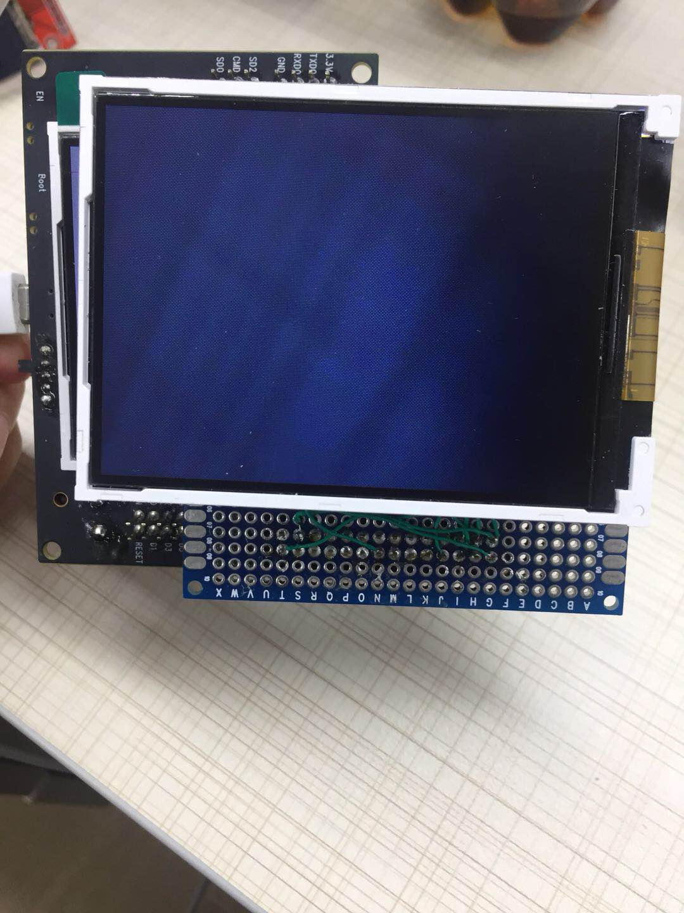

# ESP32 Camera Demo
包含分支：
- tcp 传输示例
- udp 传输示例
- arduino 示例，（这里修复了，XCLK 配置为 20MHz 出现花屏的现象）

使用的硬件有：
- `ESP-WROVER-KIT`开发板
- OV7670 摄像头
- ST7789 控制器的 LCD 屏幕

该工程实现的功能有：
- 通过手机端浏览器访问 ESP32 HTTP 服务器，查看当前摄像头采集的图像
- 摄像头采集图像、LCD 实时显示刷新速率达到 22fps
- 单独刷新屏幕达 25 fps， 单独采集图像达 27 fps

## 硬件连接
按照默认的`make menuconfig`中的默认配置连接即可。
> 注: 如果使用`ESP-WROVER-KIT`开发板，请注意把 LCD 的 reset 引脚上拉，否则 LCD 无法正常复位。

> 注: 如果 LCD 的背光灯没有正常亮起，可以将背光灯引脚直接接到高/低电平。

## 硬件实物图
该工程默认使用的为`ESP-WROVER-KIT`开发板;
<br>

<br>


## 编译运行
若选用`ESP-WROVER-KIT`开发板，下载时，请选择 ttyUSB1 ;
```
make -j8 flash
```

## 相关配置
以下是需要注意的相关配置：
<br>

<br>

<br>

<br>

